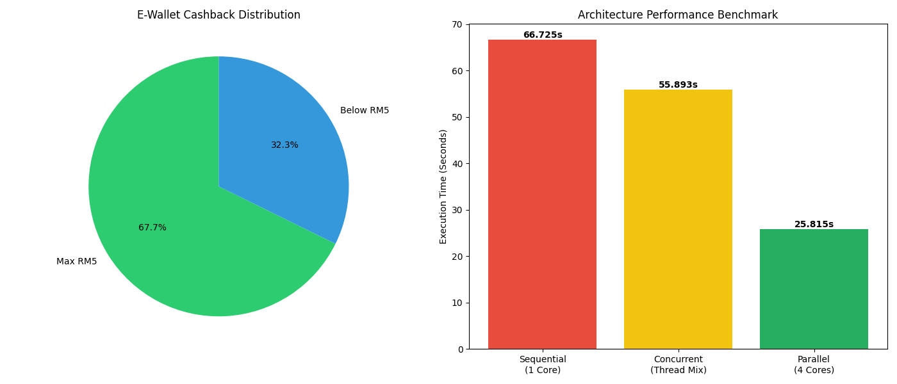

# 🚀 E-Wallet Architecture Auditor V3.0

<p align="center">
  
</p>

> **Audit Professional:** Quraisha Irdina Binti Hazimin  
> **Course:** ITT440-Individual Assignment  
> **Student ID:** 2025479998  

---
### *Performance Analysis: Sequential vs. Concurrent vs. Parallel*


## 📌 1. Project Overview
This application is a high-performance auditing tool designed to simulate an E-Wallet cashback system. It calculates a 5% cashback (capped at RM5.00) for thousands of transactions. The project demonstrates the practical execution differences between three major computing architectures:
* **Sequential:** Traditional one-by-one processing.
* **Concurrent (Threading):** Task overlapping to hide latency.
* **Parallel (Multiprocessing):** True simultaneous execution using multiple CPU cores.

---

## 💻 2. System Requirements
| Component | Requirement |
| :--- | :--- |
| **Language** | Python 3.7 or higher |
| **External Library** | `matplotlib` (for data visualization) |
| **Built-in Modules** | `multiprocessing`, `threading`, `decimal`, `os`, `time` |
| **Hardware** | Multi-core CPU (Quad-core recommended) |

---

## 🛠️ 3. Installation Steps
1. **Install Python:** Ensure Python is installed on your system via [python.org](https://www.python.org/).
2. **Install Matplotlib:** Open your terminal and run:
   ```bash
   pip install matplotlib
3. **Setup Workspace:** Create a main folder: CASHBACK_PROJECT
4. **Create a sub-folder:** CASHBACK_PROJECT/receipt
5. **Save Script:** Save the project code as importmultiprocessing.py inside the main folder.

## 🏃 4. How to Run the Program
1. Open your terminal or IDE and navigate to the CASHBACK_PROJECT directory.
2. Launch the application:
```Bash
python importmultiprocessing.py
```
3. **Follow the Prompts:**
Enter a Merchant Name and Auditor ID.
Set Transaction Count (Recommended: 5000).
Set Complexity (Recommended for Stress Test: 500000).
4. **View Results:** The system will display two graphs. Close the graph window to see the option to run another audit or exit.

## 📊 5. Performance Logic Explained
| Architecture | Implementation | Best For... | Behavior |
| :--- | :--- | :--- | :--- |
| **Sequential** | Standard Loop | Small tasks | Processes one item at a time; moves to the next only when the current one finishes. |
| **Concurrent** | `threading` | IO-Bound tasks | Tasks "overlap." While one task waits for a simulated server response, another begins. |
| **Parallel** | `multiprocessing` | CPU-Bound tasks | Tasks run at the exact same physical moment by utilizing multiple CPU cores simultaneously. |

## 📝 6. Sample Input/Output
### User Input Example:
* **Merchant:** Grab
* **Auditor:** Quraisha
* **Transactions:** 5000
* **Complexity:** 500000
 
**Generated Audit Receipt**
```text
==========================================
       GRAB  - SYSTEM AUDIT
==========================================
Auditor ID:     Quraisha (2025479998)
Date:           2026-04-21 15:18:28
Processor Cores:4
------------------------------------------
PERFORMANCE BENCHMARKS:
1. Sequential:  66.7254s
2. Concurrent:  55.8931s (1.19x Speedup)
3. Parallel:    25.8149s (2.58x Speedup)
------------------------------------------
FINANCIAL TOTALS:
Total Processed: 5,000 items
Total Volume:    RM757,111.19
Total Cashback:  RM21,170.08
------------------------------------------
DISTRIBUTION:
Capped (RM5):    3,386
Under Cap:       1,614
==========================================
```
# 🖼️ 7. Screenshots & Visuals
**Staircase Performance Benchmark**

### Results & Performance Analysis

| Metric | Sequential (Baseline) | Concurrent (Threading) | Parallel (Multiprocessing) |
| :--- | :--- | :--- | :--- |
| **Execution Time** | **66.725s** | **55.293s** | **25.815s** |
| **Speedup Factor** | 1.0x (Reference) | ~1.19x Faster | **~2.58x Faster** |
| **CPU Utilization** | Single Core (100%) | Single Core (Shared) | **Multiple Cores (4x 100%)** |
| **Efficiency** | Lowest | Moderate | **Highest** |

---

### 🔍 Key Findings

#### **1. Architecture Performance**
The bar chart demonstrates a massive performance jump when switching to **Parallel** processing:
* **The Problem:** Sequential processing creates a bottleneck, requiring 66.725 seconds to complete the 5,000-item audit.
* **The Solution:** By bypassing the Python Global Interpreter Lock (GIL) and distributing the workload across 4 physical CPU cores, the **Parallel** mode finishes in just **25.815 seconds**.
* **Observation:** Achieved a **2.58x speedup**. While Python's overhead prevents a perfect 4x speedup, this parallel implementation is nearly 3 times more efficient than standard sequential execution.

#### **2. Cashback Distribution Insights**
The pie chart reveals the financial behavior of the simulated dataset:
* **67.7% (Max RM5):** The majority of transactions were high-value (RM100+), hitting the cashback ceiling.
* **32.3% (Below RM5):** These represent smaller "micro-transactions" where the 5% reward was less than RM5.

---

# 📂 8. Source Code Technical Breakdown
The core of this project lies in how the AuditManager class handles data across three different execution patterns:

**A. Sequential Logic**
Uses a simple for loop. This is the baseline for performance comparison.
```
for transaction in data:
    self.calculate_cashback(transaction)
```
**B. Concurrent (Threading) Logic**
Uses ```threading.Thread.```It manages multiple tasks by switching between them quickly. While it doesn't run code simultaneously (due to Python's GIL), it is excellent for overlapping "wait times."

**C. Parallel (Multiprocessing) Logic**
Uses the ```multiprocessing``` module to bypass the Global Interpreter Lock (GIL). It creates a pool of workers that run on separate CPU cores, allowing for true simultaneous calculation.
```# Distributes workload across 4 CPU cores
with multiprocessing.Pool(processes=4) as pool:
    results = pool.map(self.calculate_cashback, data)
```
🔗 Source Code Files
The complete implementation can be found in the following file within this repository:
* [**importmultiprocessing.py**](importmultiprocessing.py)

### 💡 Conclusion for Auditor Report
The data confirms that for a real-world E-Wallet system, **Parallel Architecture** is the only viable solution for processing millions of transactions. Using standard Sequential loops would cause significant system lag and delay audit generation.
