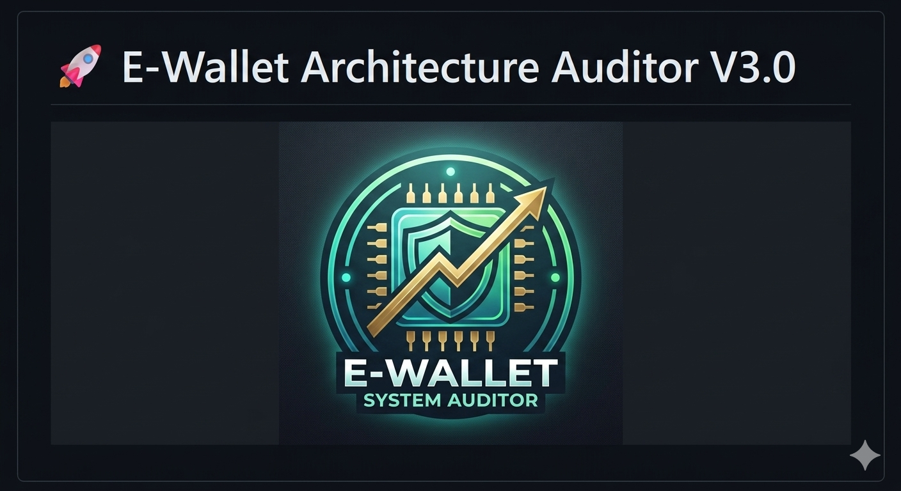

# 🚀 E-Wallet Architecture Auditor V3.0

<p align="center">
  
</p>

> **Audit Professional:** Quraisha Irdina Binti Hazimin  
> **Course:** ITT440-Individual Assignment  
> **Student ID:** 2025479998  

---
### *Performance Analysis: Sequential vs. Concurrent vs. Parallel*


## 📌 1. Project Overview
This application is a high-performance auditing tool designed to simulate an E-Wallet cashback system. It calculates a 5% cashback (capped at RM5.00) for thousands of transactions. The project demonstrates the practical execution differences between three major computing architectures:
* **Sequential:** Traditional one-by-one processing.
* **Concurrent (Threading):** Task overlapping to hide latency.
* **Parallel (Multiprocessing):** True simultaneous execution using multiple CPU cores.

---

## 💻 2. System Requirements
| Component | Requirement |
| :--- | :--- |
| **Language** | Python 3.7 or higher |
| **External Library** | `matplotlib` (for data visualization) |
| **Built-in Modules** | `multiprocessing`, `threading`, `decimal`, `os`, `time` |
| **Hardware** | Multi-core CPU (Quad-core recommended) |

---

## 🛠️ 3. Installation Steps
1. **Install Python:** Ensure Python is installed on your system via [python.org](https://www.python.org/).
2. **Install Matplotlib:** Open your terminal and run:
   ```bash
   pip install matplotlib
3. **Setup Workspace:** Create a main folder: CASHBACK_PROJECT
4. **Create a sub-folder:** CASHBACK_PROJECT/receipt
5. **Save Script:** Save the project code as importmultiprocessing.py inside the main folder.

## 🏃 4. How to Run the Program
1. Open your terminal or IDE and navigate to the CASHBACK_PROJECT directory.
2. Launch the application:
```Bash
python importprocessing.py
```
3. **Follow the Prompts:**
Enter a Merchant Name and Auditor ID.
Set Transaction Count (Recommended: 5000).
Set Complexity (Recommended for Stress Test: 500000).
4. **View Results:** The system will display two graphs. Close the graph window to see the option to run another audit or exit.

## 📊 5. Performance Logic Explained
| Architecture | Implementation | Best For... | Behavior |
| :--- | :--- | :--- | :--- |
| **Sequential** | Standard Loop | Small tasks | Processes one item at a time; moves to the next only when the current one finishes. |
| **Concurrent** | `threading` | IO-Bound tasks | Tasks "overlap." While one task waits for a simulated server response, another begins. |
| **Parallel** | `multiprocessing` | CPU-Bound tasks | Tasks run at the exact same physical moment by utilizing multiple CPU cores simultaneously. |

## 📝 6. Sample Input/Output
### User Input Example:
* **Merchant:** Grab
* **Auditor:** Quraisha
* **Transactions:** 5000
* **Complexity:** 500000
 
**Generated Audit Receipt**
```text
==========================================
       GRAB - SYSTEM AUDIT
==========================================
Auditor ID:     Quraisha
Date:           2026-04-20 13:21:51
Processor Cores:4
------------------------------------------
PERFORMANCE BENCHMARKS:
1. Sequential:  1.0530s
2. Concurrent:  0.3650s (2.89x Speedup)
3. Parallel:    1.7169s (0.61x Speedup)
------------------------------------------
FINANCIAL TOTALS:
Total Processed: 500 items
Total Volume:    RM76,747.31
Total Cashback:  RM2,126.10
------------------------------------------
DISTRIBUTION:
Capped (RM5):    341
Under Cap:       159
==========================================
